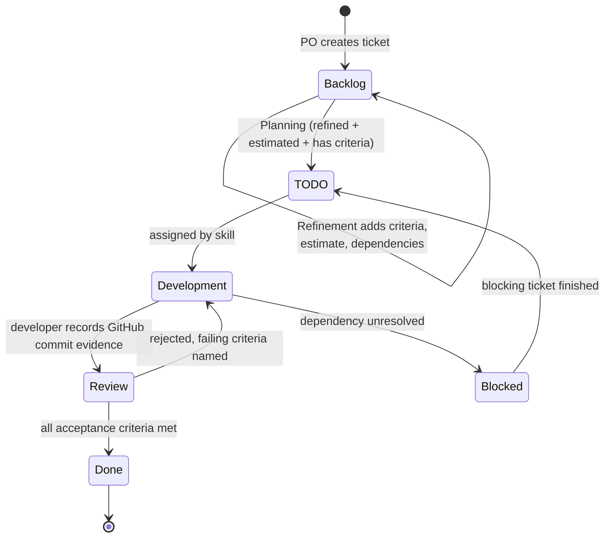
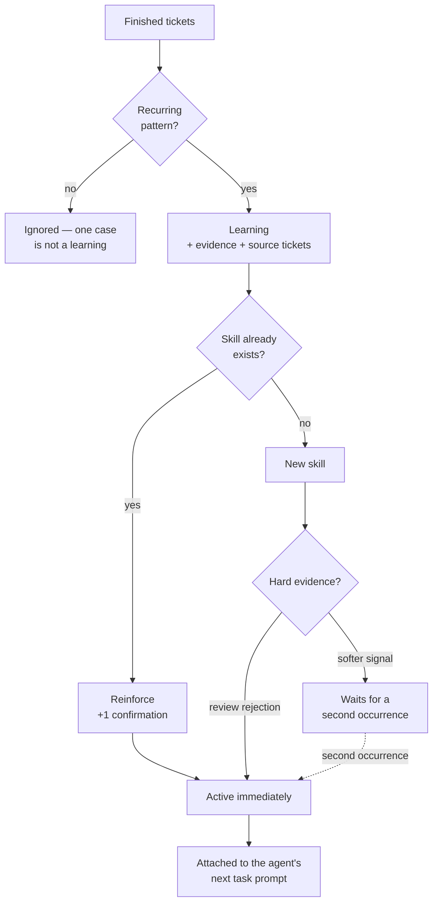
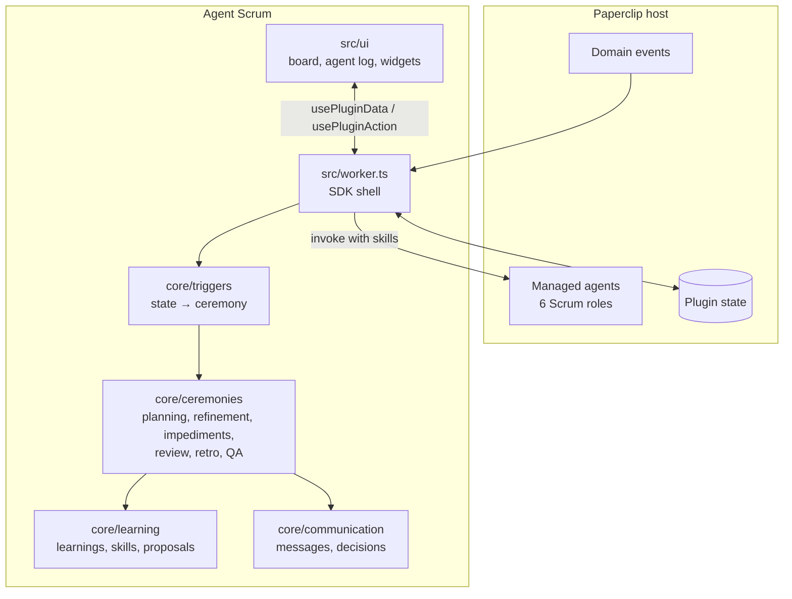

# Agent Scrum

A Paperclip plugin that runs a Scrum team of AI agents: ceremonies fire from
board state, tickets move through a Kanban board, and the retrospective turns
finished work into skills the team applies next sprint.


---

## What this is

Six agents — Product Owner, Scrum Master, Technical Lead, two Developers, QA —
move a backlog through Backlog → TODO → Development → Review → Done.

The plugin does not write code or user stories. It runs the *process*: it
decides what happens next, assigns work by skill, enforces the quality gate,
and asks the agents to do the parts that need judgement.

## What it gives you

| Need | Agent Scrum provides |
| --- | --- |
| Turn a request into controlled delivery | A human starts technical analysis for a Paperclip project; the resulting, project-bound backlog is approved, then refined with estimates and acceptance criteria. By default, a human explicitly starts Sprint Planning before delivery. Paperclip issues remain the delivery source of truth. |
| Keep work flowing without ceremony theatre | Planning, refinement, blocker resolution, review, and retrospective react to board state. A slow Scrum Master watchdog recovers stranded work without becoming a second scheduler. |
| Protect quality and approved scope | Acceptance criteria, QA review, a Developer rework hand-off, a second QA pass, and GitHub commit evidence protect the Done state. Only direct child issues of the approved kickoff are delivered; unapproved agent-created work is held for a human decision. |
| See and steer the process | The Scrum Board shows the project request, Kanban flow, ticket detail, GitHub code changes, blocked work, and manually runnable ceremonies. Sprint Progress and Team Status widgets give a compact dashboard view, while the Agent log exposes decisions and learnings. |
| Improve the next sprint | The retrospective turns recurring, evidence-backed delivery patterns into role-specific skills that accompany the next agent invocation. |
| Activate safely per organisation | Six managed roles are created only after an explicit organisation-level opt-in. Boards and settings are isolated by company, so enabling one team does not populate another. |

## Operating principles

Two decisions shape everything else:

**No scheduled ceremonies.** Every ceremony is triggered by board state. AI
agents finish work faster than any cron expression can describe, so a standup
"at 9am" would be meaningless to them. The Scrum Master has only a slow
watchdog timer that detects stranded work; it does not schedule ceremonies.

**Every event must produce something.** A ceremony that only reports is dead
weight. The daily standup was removed for exactly that reason — see
[Ceremonies](#ceremonies).

---

## Contents

1. [What it gives you](#what-it-gives-you)
2. [Install](#install)
3. [Start project work](#start-project-work)
4. [Ceremonies](#ceremonies) — what each one produces
5. [Triggers](#triggers) — what starts them
6. [Ticket lifecycle](#ticket-lifecycle)
7. [Learning loop](#learning-loop) — how the team improves
8. [Architecture](#architecture) — incl. [Agent hierarchy](#agent-hierarchy)
9. [Development](#development)
10. [Verified](#verified) and [Known limitations](#known-limitations)

---

## Install

### Prerequisites

- Node.js 22+ and pnpm
- A local Paperclip checkout you can run from source
- A running Paperclip instance (`pnpm paperclipai run`, default `http://127.0.0.1:3100`)

### 1. Fetch the plugin SDK

The plugin builds against `@paperclipai/plugin-sdk`, a workspace package inside
Paperclip that is not published to npm. Pack it from your checkout:

```bash
pnpm setup:sdk --paperclip /path/to/your/paperclip
```

This writes two tarballs into `.paperclip-sdk/` (gitignored).

### 2. Install and build

```bash
pnpm install
pnpm build
```

### 3. Install into your instance

```bash
paperclipai plugin install /absolute/path/to/paperclip-agent-scrum-plugin
```

Expected output:

```
✓ Installed schapat.agent-scrum v2.1.0 (ready)
```

### Update an existing local installation

Build the new bundle, then ask the local host to reload its installed plugin:

```bash
pnpm build
paperclipai plugin upgrade schapat.agent-scrum
```

For a local-path installation, Paperclip retains the package binding and reloads
the rebuilt `dist/` files. The upgrade preserves organisation-scoped plugin
configuration and state.

### 4. Activate the team for your organisation

Installing the plugin does **not** create agents. Creating six agents is a
visible, budget-relevant change to an organisation, so it needs an explicit
opt-in — one organisation may want the Scrum team while another only wants the
plugin available.

In the plugin settings, switch on **"Activate the Scrum team for this
organisation"**. From the CLI:

```bash
paperclipai plugin config:set schapat.agent-scrum \
  --company-id <your-company-id> \
  --payload-json '{"configJson":{"enableTeam":true}}'
```

Until this is on, the plugin runs, shows an empty board, and creates nothing.
If the setting cannot be read it stays off — failing closed is the only safe
direction when the alternative is populating someone's company uninvited.

### Plugin settings

Settings are scoped to an organisation. Configure them in Paperclip's plugin
settings or with `paperclipai plugin config:set`.

| Setting | Default | Effect |
| --- | --- | --- |
| `enableTeam` | `false` | Creates and maintains the managed Scrum team after explicit opt-in. |
| `requireProjectSprint` | `true` | Holds a new project at Sprint Planning after backlog approval; a human must start the first sprint before delivery begins. Disable only for direct delivery. |
| `enableAutoPlanning` | `true` | Enables automatic planning when sprint-ready work is waiting. |
| `enableAutoRefinement` | `true` | Enables automatic refinement when ready backlog supply runs low. |
| `enableAutoImpediments` | `true` | Enables blocker resolution and idle-capacity handling. |
| `enableAutoReview` | `true` | Enables sprint review and retrospective triggers. |
| `developerCount` | `2` | Sets the planning capacity assumption for local Scrum calculations. |
| `wipLimitDevelopment` | `4` | Sets the Development work-in-progress limit. |
| `wipLimitReview` | `3` | Sets the Review work-in-progress limit. |
| `apiBaseUrl` | `http://127.0.0.1:3100` | Lets the plugin maintain reporting lines, the runtime policy, and managed instructions through Paperclip's REST API. |
| `apiToken` | empty | Optional token for managed-agent maintenance on protected instances. |
| `githubToken` | empty | Optional token for private GitHub repositories. Onboarding uses it to validate repository access and the latest successful GitHub Actions run. |

For a direct-delivery organisation, explicitly disable the new sprint gate
before starting its project request:

```bash
paperclipai plugin config:set schapat.agent-scrum \
  --company-id <your-company-id> \
  --payload-json '{"configJson":{"enableTeam":true,"requireProjectSprint":false}}'
```

### 5. Open the board

Open **Scrum Board** in the **Work** section of the Paperclip sidebar.

This step matters. The six agents are created the first time the board is
opened (with the team activated).

The reason is a host rule worth knowing about: company-scoped calls are only
permitted inside an invocation the host started — an event, an action, or a
`getData` request. A call made from the worker's `setup()` carries no
invocation id and is rejected with *"company context is required"*. So the
plugin waits for the first request, takes the company from it, and reconciles
the team then. That also means it always binds to the company you are actually
looking at, instead of guessing.

### 6. Verify

```bash
paperclipai plugin inspect schapat.agent-scrum
paperclipai plugin logs schapat.agent-scrum
```

While developing, keep `pnpm dev` running — Paperclip watches `dist/` and
reloads the worker after each rebuild.

### Event routing and watchdog

The plugin worker is the primary coordinator: it reacts to Kanban and project
events, evaluates deterministic ceremony rules, then wakes the role that owns
the next piece of work. The delivery roles do not poll their queues.

- The Scrum Master is the sole timer-driven watchdog. It runs every **30
  minutes**, checks only stranded approved work, blockers, and WIP violations,
  then documents, wakes, or escalates the responsible role.
- Product Owner, Technical Lead, QA, and both Developers have no timer. They
  remain available through `wakeOnDemand` and run only after an assignment or a
  targeted plugin event.
- Every role permits at most one concurrent run. The worker remains the source
  of truth for operational ceremony triggers; the watchdog is a recovery path,
  not a second scheduler.

The declaration configures newly created agents. On every reconciliation the
plugin merges this runtime policy into existing agents without resetting their
adapters, models, budgets, or unrelated runtime settings. It materializes the
managed `AGENTS.md` when missing, or append-only adds the event-routing rule to
an existing customized bundle; it does not delete custom instructions.

## Start project work

Use this flow when an existing Paperclip project already points at a repository
or local checkout — for example, when a client asks for a new component in an
established website.

1. In Paperclip, make sure the project has a **primary workspace**. Its
  repository or local-folder link is the codebase the agents analyze and use
  for delivery. For a GitHub remote, onboarding verifies repository access,
  at least one GitHub Actions workflow, and the latest successful workflow run
  before it creates the kickoff issue. Set `githubToken` for a private
  repository.
2. Open **Scrum Board** and choose the Paperclip project under **Start a project
  request**.
3. Enter the requested outcome and any non-negotiable constraints. For example:

  ```text
  Build a responsive, accessible image slider.
  Use the existing design system and do not add a new dependency.
  ```

4. Select **Start technical analysis**. The plugin creates a project-bound
  kickoff issue and wakes the Technical Lead. The analysis is recorded on that
  issue: relevant files and patterns, tests, risks, and a proposed approach.
5. The Technical Lead closes the analysis comment with
  `<!-- agent-scrum:technical-analysis-complete -->`. Until then, story
  discovery stays locked in the board. Review the completed analysis, then
  select **Start story discovery**. The Product
  Owner reads the analysis and creates a small initial backlog as child issues
  of the kickoff issue, retaining the project and workspace context.
6. Review the proposed backlog and select **Approve backlog for sprint planning**.
  By default, the plugin records the approval, holds delivery at Sprint Planning,
  and asks the Technical Lead to refine every unready child issue. A refinement
  comment ends with
  `<!-- agent-scrum:refinement:v1 {...} -->`; it contributes story points,
  acceptance criteria, technical notes, and risks to the board.
7. Once at least one child issue is refined, estimated, and has acceptance
  criteria, select **Start first sprint**. The plugin creates the active Sprint
  context, then host-backed Sprint Planning moves eligible issues from Backlog
  to TODO in Paperclip, assigns a free developer, and wakes that developer.
  No project delivery status is mutated only in the plugin.
8. Set `requireProjectSprint` to `false` before starting a project request only
  when your organisation intentionally wants the previous direct-delivery flow.

For project-backed work, Paperclip issues are the source of truth for status,
assignment, and review. The Scrum Board mirrors their current state; change
delivery status in the Paperclip issue workflow rather than dragging a board
card.

The kickoff ticket remains visible in the Project work area of the board. It is
not a backlog story; it is the shared analysis and decision record for the
project request. Child-issue comments and structured decisions are projected
into the ticket details, while the project widget reports task progress until
all stories have estimates and story-point progress afterwards.

### Review routing

When a developer submits a project-backed issue for review, Agent Scrum assigns
the issue to QA and wakes the QA agent. A developer can request a product
decision by including `<!-- agent-scrum:po-decision-required -->` in the review
comment. The plugin assigns that review to the Product Owner until the Product
Owner records `<!-- agent-scrum:po-decision-resolved -->`; then QA receives the
technical review.

For project-backed work, a direct Developer transition to Done is returned to
QA review. QA records `<!-- agent-scrum:qa-review-approved -->` before closing
the reviewed issue. The board also mirrors active Developer and QA assignments,
and only releases a blocked issue after every Paperclip blocker is done.

### GitHub delivery evidence

For a project whose primary workspace is linked to GitHub, every delivered
ticket needs a Developer-recorded commit marker before it can remain Done:

```html
<!-- agent-scrum:commit:v1 {"sha":"<full-sha>","url":"https://github.com/<owner>/<repo>/commit/<full-sha>","message":"<commit message>"} -->
```

The marker is accepted only from a managed Developer. A direct or QA-approved
completion without it returns to Development and wakes a Developer with the
required format in the ticket comments. The ticket detail dialog's **Code** tab
loads the recorded commit from the project's repository, then shows affected
files, additions, deletions, and expandable GitHub patches.

When QA finds a defect, it records the failed criteria, returns the issue to
Development, and assigns a Developer. As a host-side safeguard, Agent Scrum
detects a project issue in Development still assigned to QA, assigns the least
loaded Developer, records the hand-off, and wakes that Developer. The repair
must return to Review before QA can close it.

Blocked tickets remain visible in the Backlog column under a separate
**Blocked** section. They retain their Paperclip `blocked` status; the shared
column is a compact overview, not a workflow transition.

### Project scope control

The direct child issues of an approved kickoff are the complete delivery scope.
When every direct child issue is Done, the request becomes **Project complete**;
the plugin does not start successor refinement, planning, or delivery work.
The panel keeps the completion and any held work visible, then offers **Start
next project request** as the only explicit human path to a new scope.

An empty board, idle capacity, a timer heartbeat, or a refinement suggestion is
not a request for new product scope. Automatic local refinement can report a
missing backlog, but it cannot ask the Product Owner to create new stories. A
human-initiated refinement remains available for intentionally starting such
work.

If a managed Scrum agent creates an open issue outside an active project, Agent
Scrum sets it to `blocked`, clears its assignee, and records **Human scope
approval required**. The held issue remains auditable in Paperclip and appears
as a scope warning in the Project work panel; it never becomes project delivery
until a human explicitly starts or approves the scope.

The first version supports one active project request per organisation. Create
or finish that request before starting another one.

---

## Ceremonies

An event earns its place only if it leaves something behind. Measured by what
each one persists:

| Ceremony | Produces | Value |
|---|---|---|
| **Backlog Refinement** | Asks the Technical Lead for acceptance criteria, estimates, dependencies and risks; flags oversized tickets for splitting; asks the PO for new items | **High** — without ready tickets, planning has nothing to pull |
| **Sprint Planning** | Pulls tickets into the sprint within capacity, assigns by skill, starts the work | **High** — nothing moves without it |
| **QA Review** | Accepts to Done, or rejects to Development naming the criteria that failed | **High** — the only quality gate |
| **Impediment Resolution** | Clears blockers whose cause is gone, escalates real ones with a concrete task, fills idle capacity | **High** — keeps flow alive |
| **Sprint Review** | Records velocity, proposes follow-up work, asks the PO to decide on carry-over | **Medium–high** — connects delivery to planning |
| **Sprint Retrospective** | **Learnings → skills**, plus proposed backlog items | **High** — the only event that makes the team *better* |
| ~~Daily Scrum~~ | ~~Status reports~~ | **Removed** |

### Why the daily standup was removed

A standup exists so humans can find out what everyone else is doing. Agents
have no such problem — the board is fully visible to all of them at all times.
A report saying "I finished X and I'm working on Y" only repeats what the board
already shows.

Measurement confirmed it: the daily changed **no ticket at all**. It produced
messages and nothing else.

What *was* valuable was the Scrum Master's part — spotting blockers and idle
capacity. That is now **Impediment Resolution**, which acts instead of
reporting. When there is nothing to resolve, it deliberately leaves no record.

---

## Triggers

Ceremonies are evaluated after every board change, never on a timer.

| Trigger | Condition | Starts |
|---|---|---|
| `todo-empty` | TODO empty **and** refined tickets waiting | Sprint Planning |
| `no-development` | Nothing in Development and nothing sprint-ready | Refinement |
| `backlog-low` | Fewer than 5 sprint-ready tickets | Refinement |
| `blocked-tasks` | At least one ticket blocked | Impediment Resolution |
| `developer-idle` | A developer is free while TODO has work | Impediment Resolution |
| `sprint-complete` | Every sprint ticket is done | Sprint Review |
| `review-without-retro` | A review exists, the retrospective does not | Retrospective |


Two properties keep this stable:

- **Edge-triggered.** A condition fires when it *becomes* true, not while it
  stays true. Without this, a permanently empty TODO would restart planning
  forever. Once the condition goes false it is armed again.
- **Cascade limit.** A ceremony may trigger the next one (Review → Retro); the
  chain stops after five rounds.

Each trigger can be switched off individually in the plugin settings. Every
ceremony stays manually runnable from the board's ceremony bar.

---

## Ticket lifecycle



A ticket can only reach Done through Review — `in_progress → done` is not a
legal transition. Project-backed GitHub tickets also need Developer-recorded
commit evidence before QA can leave them Done. Rejection is not a dead end: QA
names the criteria that failed, and that feedback lands in the ticket's comment
history.

---

## Learning loop

The retrospective is how the team stops repeating itself. It inspects the
tickets finished in the sprint and looks for **evidence-backed patterns**:

| Source | Detected | Becomes |
|---|---|---|
| Review rejections | Same rejection reason on ≥ 2 tickets | Skill for developers, active immediately |
| Materialised risks | Risk was known, ticket blocked or rejected anyway | Skill for Tech Lead + developers |
| Flow bottlenecks | Column with ≥ 48h average dwell time | Skill for the responsible role |
| Technical notes | Notes on completed tickets | Reusable code knowledge |



Two rules keep this honest:

- **Every learning carries its evidence** and the tickets it came from. It is
  checkable, not invented.
- **A single case is not a learning.** One rejected ticket is normal; the same
  reason twice is a pattern. Softer signals start inactive and activate only
  when the pattern repeats — otherwise the skill list fills with noise.

Active skills are visible under **Agent log → Learnings** and are attached to
the prompt whenever the plugin wakes an agent for that role.

---

## Architecture



| Path | Responsibility |
|---|---|
| `src/manifest.ts` | Manifest: capabilities, UI slots, the six managed agents |
| `src/worker.ts` | SDK shell — loads state, exposes data/actions, evaluates triggers |
| `src/core/ceremonies/` | The six ceremonies plus skill-based assignment |
| `src/core/triggers/` | State conditions that start ceremonies, edge-triggered |
| `src/core/learning/` | Learning extraction, skills, story proposals |
| `src/core/communication/` | Agent messages and reasoned decisions |
| `src/core/types.ts` | Domain model (ticket, sprint, learning, skill) |
| `src/ui/` | Board page and two dashboard widgets |
| `agents/<key>/AGENTS.md` | Instructions for each managed agent |

Ceremonies are pure functions over a `WorkerState` value, which is why they are
testable without a running host.

### Agent hierarchy

The intended reporting line:

```
Company lead (CEO)
  └─ Product Owner
  └─ Scrum Master
  └─ Technical Lead
       └─ Developer 1
       └─ Developer 2
  └─ QA Engineer
```

Developers report to the Technical Lead; everyone else reports to the company
lead. That mirrors how ceremonies actually escalate — the Tech Lead receives
blocked tickets and refinement work and hands implementation down.

**The plugin API cannot express this.** The managed-agent schema has no
`reportsTo` field, the host's `declarationPatch` does not map one, and
`ctx.agents` offers no update method. Managed agents are therefore always
created without a superior.

The host's REST API *can* do it, though: `PATCH /api/agents/:id` accepts
`reportsTo` — `updateAgentSchema` inherits the field from `createAgentSchema`
and the handler passes the body straight to `svc.update`. Verified directly:

```bash
curl -X PATCH http://127.0.0.1:3100/api/agents/<developer-id> \
  -H 'content-type: application/json' \
  -d '{"reportsTo":"<technical-lead-id>"}'
```

So the plugin sets it over the REST API right after creating the team. Fill in
`apiBaseUrl` in the plugin settings (default `http://127.0.0.1:3100`), plus
`apiToken` on an instance that requires authentication — one running in
`local_trusted` mode accepts the call without a token.

One detail worth knowing: this uses Node's global `fetch`, **not**
`ctx.http.fetch`. The host client applies SSRF protection and blocks private
IPs, so it can never reach the Paperclip instance itself — which is the only
host this call ever targets. The SDK explicitly permits plugins to use `fetch`
directly.

Two fallbacks, if no `apiBaseUrl` is configured or a call fails:

- **Drift is reported.** After each reconcile the plugin logs which agent
  should report to whom.
- **The instructions state it.** Each agent's `AGENTS.md` names its reporting
  line, so escalation behaviour is right even when the org chart is flat.

The single source for all of this is `src/team.ts` — the manifest derives its
agent declarations from it, so the two cannot drift apart.

### What the plugin does *not* do

It never invents content. User stories, acceptance criteria and estimates are
requested from the responsible agent via `ctx.agents.invoke`, carrying that
role's active skills as context. The plugin decides *what needs doing and by
whom*; the agents decide *what it says*.

---

## Development

```bash
pnpm setup:sdk --paperclip /path/to/paperclip   # once
pnpm install
pnpm dev                                        # watch build
pnpm test                                       # 372 tests
pnpm typecheck
```

Tests live next to the code they cover, under `src/core/**/__tests__/`.

---

## Verified

Against a live instance (`paperclipai plugin install`, then a `bridge:data`
call carrying company scope):

- Installs and reaches `ready`; registry, manifest and status health checks pass.
- **Nothing is created without consent:** with the team switched off the board
  reports 0 agents; switching `enableTeam` on and reopening the board produces
  exactly the six.
- All six managed agents are created and adopted — and only those six. A company
  usually has other agents (a CEO, other teams); they are deliberately not put
  on the Scrum board.
- Creating a ticket works, and an unrefined ticket **automatically triggers
  Backlog Refinement** — the state-driven trigger chain works end to end.
- **The reporting line is applied automatically:** after activation both
  developers report to the Technical Lead, everyone else to the company lead.
- **Concurrent page loads are safe.** Three simultaneous `getData` calls produce
  exactly six agents, not partial teams.
- **Organisations are isolated.** Each company gets its own board and its own
  opt-in; activating one leaves the other untouched.
- **The local v2.1.0 upgrade is healthy.** The host reports the GitHub token
  setting, updated Developer commit-evidence instructions, a valid manifest,
  and `ready` health after reloading the local package path.

## Known limitations

Stated plainly, because the alternative is a README that lies:

- **Skills are delivered per invocation, not written into instructions.** The
  plugin maintains only its own event-routing rule in the managed bundle;
  active skills still travel with each wake-up prompt rather than becoming
  persistent `AGENTS.md` content.
- **Local and project-backed boards have different sources of truth.** Ad-hoc
  local tickets still live in plugin state. Direct child issues of a project
  kickoff are projected from Paperclip; their status, assignment, comments,
  decisions, refinement, and planning transitions are host-backed.
- **Agent wake-up is not observed.** `ctx.agents.invoke` is called when a
  ceremony requests content, but whether the agents then produce user stories or
  acceptance criteria was not watched end to end.
- **Ceremony summaries and agent messages are in German.** The code, README and
  comments are English; the operational text the agents read is not yet.
- **Hierarchy setup needs a reachable API.** The plugin sets the reporting line
  over `PATCH /api/agents/:id`. On an instance requiring authentication, set
  `apiToken` in the plugin settings; without a reachable API the plugin falls
  back to reporting the drift.
- **GitHub delivery evidence targets github.com and GitHub Actions.** Other
  forges are not validated at onboarding. GitHub can omit a file patch for very
  large or binary changes; the Code tab still lists the file and its change
  statistics in that case.
- **No performance measurements.** Nothing here has been profiled under load.

---

## License

MIT
