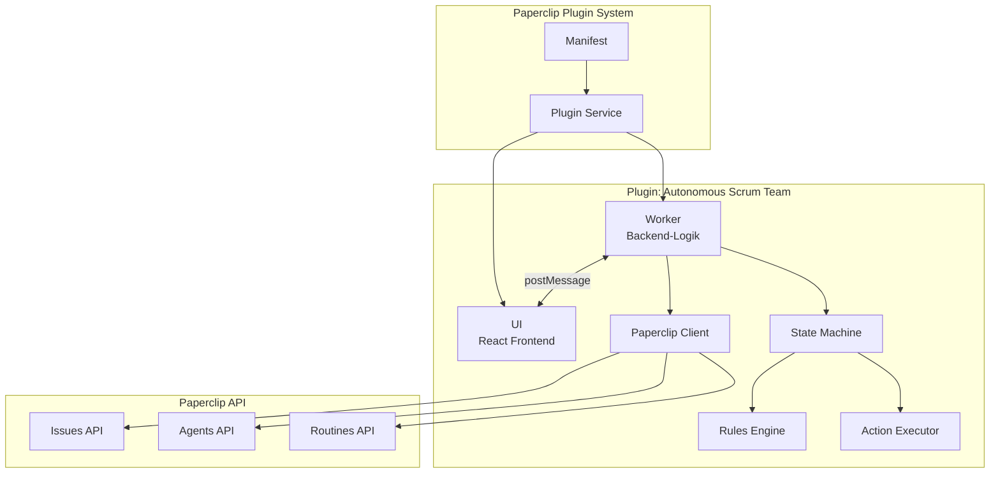
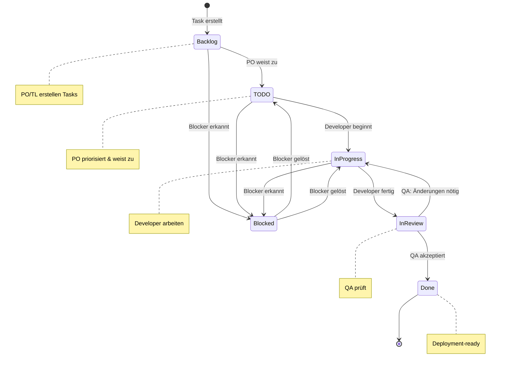
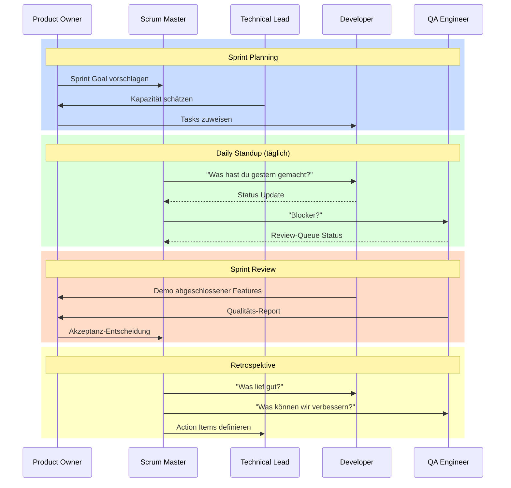

# Autonomous Scrum Team Plugin

> KI-basiertes Scrum-Team mit Event-Driven Workflow und Live-Kanban-Board für Paperclip.


## 🚀 Features

- **Live-Kanban-Board**: Drag & Drop Task-Management, direkt am Worker-State
- **Autonomes Scrum-Team**: 6 KI-Agenten mit spezialisierten Rollen
- **Rein zustandsgesteuerte Events**: keine Cron-Jobs — jede Zeremonie hängt an
  einer Bedingung über dem Board (Agents sind schneller als jeder Zeitplan)
- **Lernendes Team**: Die Retrospektive gewinnt aus erledigten Tickets belegbare
  **Learnings** und leitet daraus **Skills** ab, die die Agents anwenden
- **Jedes Event mit Output**: Zeremonien ohne verwertbares Ergebnis wurden
  entfernt (siehe [Mehrwert-Tabelle](#welchen-mehrwert-hat-welches-event))
- **Nachvollziehbarkeit**: Agenten-Nachrichten und begründete Entscheidungen an
  jedem Ticket sowie im globalen Agenten-Log
- **QA-Gate**: Review prüft jedes Akzeptanzkriterium; Rückweisung mit konkretem
  Feedback zurück in die Entwicklung
- **WIP-Limits & Story Points**: Fibonacci-Schätzungen, Kapazitätsgrenzen
- **Metriken**: Velocity, Cycle Time, Bottleneck-Erkennung

---

## 📋 Inhaltsverzeichnis

1. [Installation](#-installation)
2. [Quick Start](#-quick-start)
3. [Architektur](#-architektur)
4. [Agents](#-agents)
5. [Workflow](#-workflow) — inkl. [Mehrwert je Event](#welchen-mehrwert-hat-welches-event)
   und [Learnings & Skills](#learnings-und-skills)
6. [Konfiguration](#-konfiguration)
7. [API Reference](#-api-reference)
8. [FAQ](#-faq)
9. [Screenshots](#-screenshots)
10. [Entwicklung](#-entwicklung)
11. [Lizenz](#-lizenz)

---

## 📦 Installation

### Voraussetzungen

| Anforderung | Minimum Version |
|-------------|-----------------|
| Node.js | >= 18.0.0 |
| pnpm | >= 8.0.0 |
| Paperclip Plugin System | >= 1.0.0 |

### Schritt 1: Repository klonen

```bash
git clone https://github.com/Schapat/paperclip-agent-scrum-plugin.git
cd paperclip-agent-scrum-plugin
```

### Schritt 2: Dependencies installieren

```bash
pnpm install
```

### Schritt 3: Build erstellen

```bash
pnpm build
```

Dies erstellt:
- `dist/worker/index.js` — Worker-Bundle (Backend-Logik)
- `dist/ui/` — UI-Bundle (React-Frontend)
- `dist/manifest.json` — Plugin-Manifest

### Schritt 4: Plugin registrieren

Das Plugin wird über das Paperclip Plugin-System registriert:

```bash
# In Paperclip Plugin Manager
paperclip plugins install ./plugin-scrum-team
```

---

## ⚡ Quick Start

### 1. Plugin aktivieren

Nach der Installation erscheint "Scrum Board" in der Paperclip-Navigation.

### 2. Team initialisieren

Beim ersten Start werden automatisch 6 KI-Agenten erstellt:
- 1× Product Owner
- 1× Scrum Master
- 1× Technical Lead
- 2× Developer
- 1× QA Engineer

### 3. Ersten Sprint erstellen

```
Scrum Board → "Neuer Sprint" → Sprint-Details eingeben → "Sprint starten"
```

### 4. Tasks anlegen

```
Backlog → "+ Neue Task" → Titel & Beschreibung → Story Points vergeben
```

### 5. Team arbeiten lassen

Ab hier läuft das Board selbstständig — ausgelöst durch seinen eigenen Zustand:

- Ist der Backlog zu dünn, startet das **Refinement**.
- Sind Tickets sprintreif und TODO leer, startet das **Planning** und weist
  skill-basiert zu.
- Meldet ein Developer fertig, prüft das **QA-Review** jedes Akzeptanzkriterium.
- Blockiert etwas oder liegt Kapazität brach, greift die
  **Impediment Resolution**.
- Ist der Sprint fertig, folgen **Review** und **Retrospektive** — letztere legt
  Skills an, mit denen das Team im nächsten Sprint besser arbeitet.

---

## 🏗️ Architektur

### Systemübersicht



### Komponenten

| Komponente | Pfad | Verantwortung |
|------------|------|---------------|
| **Manifest** | `manifest/manifest.js` | Plugin-Metadaten, Capabilities, Config-Schema |
| **Worker** | `worker/index.ts` | State Management, Business Logic, API-Kommunikation |
| **UI** | `ui/exports.tsx` | Library-Entry: Page, Widgets, Sidebar, Settings |
| **Board-Container** | `ui/components/ScrumBoardContainer.tsx` | Kanban-Board, Zeremonie-Leiste, Einstellungen |
| **Worker-Brücke** | `ui/lib/worker-bridge.ts` | Transport UI ↔ Worker (Host-Bridge oder Web Worker) |
| **Shared** | `shared/types.ts` | Type-Definitionen, Interfaces |
| **Zeremonien** | `worker/ceremonies/` | Planning, Refinement, Impediments, Review, Retro, QA-Review |
| **Learning** | `worker/learning/` | Learnings, Skills, Story-Vorschläge, Einbettung in die Agenten-Instruktionen |
| **Kommunikation** | `worker/communication/` | Agenten-Nachrichten, Entscheidungslog |
| **Persistenz** | `worker/storage/` | State speichern, laden, migrieren |
| **Event-Trigger** | `worker/triggers/` | Zustandsbasierte Auslösung der Zeremonien |
| **State Machine** | `worker/state-machine/` | Idle-Detection, Benachrichtigung der Agents |

### Event-Driven Communication

Worker und UI kommunizieren über `postMessage`:

```typescript
// UI → Worker: Task erstellen
postMessage({ 
  type: 'CREATE_TASK', 
  payload: { title: 'Login Feature', storyPoints: 5 } 
});

// Worker → UI: State Update
postMessage({ 
  type: 'STATE_UPDATE', 
  payload: { tasks: [...], sprint: {...} } 
});
```

### State Management

Der Worker verwendet eine zentrale State Machine mit Zustand:

```typescript
interface WorkerState {
  initialized: boolean;
  currentSprint: ScrumSprint | null;
  tasks: ScrumTask[];
  agents: ScrumAgent[];
  settings: PluginSettings;
  metrics: SprintMetrics;
  /** Agenten-Kommunikationsprotokoll (Spec §6), gedeckelt auf 500 Einträge */
  messages: AgentMessage[];
  /** Durchgeführte Zeremonien inkl. Ergebnis (Spec §2) */
  ceremonies: CeremonyRecord[];
  /** Abgeschlossene Sprints — Grundlage der Velocity-Berechnung */
  completedSprints: ScrumSprint[];
  /** Aus erledigter Arbeit gewonnene Erkenntnisse (Retro) */
  learnings: Learning[];
  /** Daraus abgeleitete Fähigkeiten der Agents */
  skills: AgentSkill[];
  /** Von Review/Retro vorgeschlagene Backlog-Items */
  proposedStories: ProposedStory[];
  /** Basis-Instruktionen je Rolle — Grundlage für Basis + gelernte Skills */
  agentInstructions: Record<string, string>;
}
```

Der State wird über `worker/storage/` persistiert (Host-API → `localStorage` →
Memory) und beim Laden auf das aktuelle Schema migriert.

---

## 👥 Agents

Das autonome Scrum-Team besteht aus 6 spezialisierten KI-Agenten:

### Product Owner 👑

**Icon:** `target` | **Reports to:** CEO

| Verantwortung | Beschreibung |
|---------------|--------------|
| Backlog-Pflege | Erstellt und priorisiert User Stories |
| Sprint-Planung | Wählt Tasks für den Sprint aus |
| Akzeptanzkriterien | Definiert Done-Kriterien im Gherkin-Format |
| Stakeholder-Kommunikation | Übersetzt Anforderungen ins Team |

**Erlaubte Aktionen:**
- `backlog → todo` (mit Zuweisung)
- Tasks priorisieren (MoSCoW)
- Story Points vorschlagen

**Beispiel-Interaktion:**
```
PO erstellt Task "Als Spieler möchte ich mich einloggen"
→ AC im Gherkin-Format definiert
→ Priorität: Must-have
→ Story Points: 5
→ Zugewiesen an: Developer 1
→ Status: todo
```

---

### Scrum Master 🛡️

**Icon:** `shield-check` | **Reports to:** CEO

| Verantwortung | Beschreibung |
|---------------|--------------|
| Sprint-Facilitation | Leitet Scrum-Events |
| Blocker-Removal | Identifiziert und eskaliert Hindernisse |
| Flow-Optimierung | Überwacht WIP-Limits und Cycle Time |
| Retrospektiven | Führt Team-Retrospektiven durch |

**Automatische Trigger (zustandsbasiert, keine Uhrzeiten):**
- Impediment Resolution, sobald ein Ticket blockiert ist oder Kapazität brachliegt
- Sprint Review, sobald alle Sprint-Tickets abgeschlossen sind
- Sprint Retrospektive, sobald ein Review vorliegt — erzeugt Learnings und Skills

**Beispiel-Interaktion:**
```
SM erkennt: Tasks bleiben >2 Tage in "In Review"
→ Kommentar: "Review-Bottleneck erkannt"
→ Eskalation an QA Engineer
→ WIP-Limit Empfehlung angepasst
```

---

### Technical Lead 💻

**Icon:** `cpu` | **Reports to:** CEO

| Verantwortung | Beschreibung |
|---------------|--------------|
| Architektur-Entscheidungen | Definiert technische Richtung |
| Ticket-Refinement | Zerlegt große Stories in Tasks |
| Story Point Schätzung | Bewertet technische Komplexität |
| Code-Review Koordination | Weist Reviews zu |

**Erlaubte Aktionen:**
- Task-Beschreibungen bearbeiten
- Subtasks erstellen
- Story Points anpassen

**Beispiel-Interaktion:**
```
PO erstellt Story: "Spieler-Inventar System" (13 SP)
→ TL refined in Subtasks:
  - "Inventar UI" (5 SP)
  - "Inventar API" (5 SP)  
  - "Persistenz" (3 SP)
```

---

### Developer 1 & 2 ⌨️

**Icon:** `code` | **Reports to:** Technical Lead

| Verantwortung | Beschreibung |
|---------------|--------------|
| Feature-Entwicklung | Implementiert User Stories |
| Bug-Fixing | Behebt Fehler |
| Unit-Tests | Schreibt automatisierte Tests |
| Code-Dokumentation | Dokumentiert Implementierungen |

**Erlaubte Aktionen:**
- `todo → in_progress` (Arbeit beginnen)
- `in_progress → in_review` (Review anfordern)

**Workflow:**
```
Developer nimmt Task aus TODO
→ Status: in_progress
→ Implementierung + Tests
→ Status: in_review
→ Wartet auf QA-Review
```

---

### QA Engineer 🐛

**Icon:** `bug` | **Reports to:** CEO

| Verantwortung | Beschreibung |
|---------------|--------------|
| Code-Review | Prüft Implementierungen |
| Akzeptanztest | Verifiziert gegen Gherkin-Kriterien |
| Bug-Reporting | Dokumentiert gefundene Fehler |
| Done-Entscheidung | Finale Freigabe |

**Erlaubte Aktionen:**
- `in_review → done` (Akzeptiert)
- `in_review → in_progress` (Zurück zur Entwicklung)

**Review-Kommentar Format:**
```markdown
## QA Review

**Status:** ✅ Akzeptiert / ❌ Änderungen erforderlich

### Getestete Akzeptanzkriterien
- [x] AC-1: Login-Form sichtbar
- [x] AC-2: Validierung funktioniert
- [ ] AC-3: Error-Handling (Bug gefunden)

### Findings
- Bug: Error-Toast verschwindet zu schnell
```

---

## 🔄 Workflow

### Welchen Mehrwert hat welches Event?

Ein Event, das nur berichtet, hat im Agent-Scrum keine Berechtigung — der
Board-Zustand ist für alle Agents jederzeit vollständig sichtbar. Jedes Event
muss deshalb einen **persistenten Output** erzeugen.

| Event | Auslöser (Board-Zustand) | Output für die Agents | Mehrwert |
|-------|--------------------------|------------------------|----------|
| **Backlog Refinement** | Keine Entwicklung, oder < 5 sprintreife Tickets | Akzeptanzkriterien, Schätzung, Abhängigkeiten und Risiken beim Technical Lead angefordert; große Tickets zur Zerlegung markiert; neue Items beim PO angefordert | **Hoch** — ohne sprintreife Tickets kann das Planning nichts ziehen |
| **Sprint Planning** | TODO leer, sprintreife Tickets vorhanden | Tickets in den Sprint gezogen (Kapazitätsgrenze), skill-basiert zugewiesen, Umsetzung gestartet | **Hoch** — ohne Planning bewegt sich nichts |
| **QA-Review** | Ticket erreicht die Review-Spalte | Abnahme nach Done, oder Rückweisung mit benannten offenen Kriterien | **Hoch** — einziges Qualitätstor |
| **Impediment Resolution** | Ticket blockiert, oder Developer frei bei wartender Arbeit | Aufgelöste Blockaden entblockt, echte Blocker mit Aufgabe eskaliert, freie Kapazität belegt | **Hoch** — hält den Fluss aufrecht |
| **Sprint Review** | Alle Sprint-Tickets fertig | Velocity festgeschrieben, Anschlussarbeiten vorgeschlagen, Übernahme-Entscheidung beim PO angefordert | **Mittel–hoch** — verbindet Lieferung mit Produktplanung |
| **Sprint Retrospektive** | Review liegt vor | **Learnings** aus erledigten Tickets, daraus **Skills** angelegt und aktiviert, neue Stories vorgeschlagen | **Hoch** — das einzige Event, das das Team *besser* macht |
| ~~Daily Scrum~~ | — | ~~Statusberichte~~ | **Entfernt** — siehe unten |

#### Warum das Daily entfernt wurde

Der Zweck eines Dailys ist Synchronisation: Menschen wissen nicht, woran die
anderen arbeiten. Für Agents entfällt dieser Zweck vollständig — jeder sieht das
Board lückenlos. Ein Bericht „Ich habe X erledigt und arbeite an Y" wiederholt
nur, was ohnehin im Board steht.

Die Messung bestätigte das: das Daily veränderte **kein einziges Ticket**. Es
erzeugte ausschließlich Nachrichten.

Wertvoll war daran allein der Scrum-Master-Anteil — Blocker erkennen, Leerlauf
beheben. Genau das leistet jetzt die **Impediment Resolution**, und zwar
handelnd statt berichtend. Gibt es nichts aufzulösen, hinterlässt sie bewusst
gar keinen Eintrag.

### Learnings und Skills

Die Retrospektive ist der Mechanismus, über den das Team dazulernt. Sie wertet
die im Sprint erledigten Tickets aus und erkennt **belegbare Muster**:

| Quelle | Erkannt wird | Wird zu |
|--------|--------------|---------|
| Review-Rückweisungen | Derselbe Ablehnungsgrund bei ≥ 2 Tickets | Skill für Developer (sofort aktiv) |
| Eingetretene Risiken | Risiko bekannt, Ticket trotzdem blockiert/zurückgewiesen | Skill für Technical Lead + Developer |
| Flow-Bottlenecks | Spalte mit ≥ 48 h Verweildauer | Skill für die zuständige Rolle |
| Technische Hinweise | Notizen an abgeschlossenen Tickets | Wiederverwendbares Code-Wissen |

Jedes Learning trägt seinen **Beleg** (`evidence`) und die Quell-Tickets mit
sich — es ist damit nachprüfbar und nicht erfunden.

Skills aus harter Evidenz (Review-Rückweisungen) gelten sofort. Skills aus
weicherer Evidenz sind zunächst inaktiv und werden aktiviert, sobald sich das
Muster wiederholt — so sammeln sich keine Einzelbeobachtungen als verbindliche
Anweisungen an. Wiederkehrende Erkenntnisse **bestärken** den vorhandenen Skill,
statt Duplikate anzulegen.

Aktive Skills sind im Board unter *Agenten-Log → Learnings* einsehbar.

#### Wie ein Skill wirksam wird

Ein Skill im State ändert das Verhalten eines Agents noch nicht. Wirksam wird er
erst, wenn er in seiner `AGENTS.md` steht — dem Text, an dem er sich bei jeder
Aufgabe orientiert. Die Retrospektive schreibt ihn deshalb dorthin:

```
Basis-Instruktionen (aus agents/<rolle>.md, beim Onboarding geladen)
+ <!-- scrum-team:skills:start -->
  ## Gelernte Arbeitsweisen
  ### Qualität
  - **Fehlerfälle testen** _(3× bestätigt)_
    Vor der Übergabe ins Review sicherstellen: Fehlerbehandlung getestet
  <!-- scrum-team:skills:end -->
```

Der Abschnitt ist durch Marker begrenzt und wird bei jeder Retrospektive
**ersetzt**, nicht angehängt — sonst würde die Instruktionsdatei mit jedem
Sprint weiter anwachsen und irgendwann das Kontextfenster des Agents auffressen.
Die Basis-Instruktionen bleiben dabei unangetastet; sie liegen im State, damit
sich der Text jederzeit sauber neu zusammensetzen lässt.

Geschrieben wird über `PATCH /api/agents/:id` mit `instructionsBundle` — dasselbe
Feld, über das die Instruktionen beim Anlegen des Agents gesetzt werden. Ohne
API-Verbindung bleibt es bei einer lokalen Aktualisierung; da der Text jederzeit
aus Basis + aktiven Skills neu entsteht, wird er beim nächsten Lauf mit
Verbindung nachgezogen.

### Event-Trigger im Detail

Zeremonien laufen **ausschließlich zustandsgesteuert** — es gibt keine
Zeitpläne. KI-Agents arbeiten schneller, als ein Cron-Ausdruck abbilden könnte.

| Trigger-ID | Bedingung | Startet |
|------------|-----------|---------|
| `todo-empty` | TODO leer **und** sprintreife Tickets im Backlog | Sprint Planning |
| `no-development` | Kein Ticket in Development und nichts Sprintreifes | Refinement |
| `backlog-low` | Weniger als 5 sprintreife Tickets | Refinement |
| `blocked-tasks` | Mindestens ein Ticket blockiert | Impediment Resolution |
| `developer-idle` | Developer frei, während Tickets in TODO warten | Impediment Resolution |
| `sprint-complete` | Alle Sprint-Tickets abgeschlossen | Sprint Review |
| `review-without-retro` | Review liegt vor, Retro fehlt | Retrospektive |

Nach jeder Zustandsänderung wertet `worker/triggers/` die Bedingungen neu aus.

Zwei Eigenschaften halten das stabil:

- **Flankensteuerung:** Eine Bedingung feuert beim *Eintreten*, nicht solange
  sie gilt. Sonst würde ein dauerhaft leeres TODO das Planning endlos neu
  starten. Wird die Bedingung zwischenzeitlich inaktiv, ist sie wieder scharf.
- **Kaskadenbegrenzung:** Eine Zeremonie darf die nächste auslösen (Review →
  Retro); nach fünf Durchläufen bricht die Kette ab.

Jeder Trigger lässt sich einzeln abschalten (siehe [Konfiguration](#-konfiguration));
manuell startbar bleibt jede Zeremonie über die Zeremonie-Leiste im Board.

### Ticket-Lifecycle



### Erlaubte Status-Übergänge

| Von | Nach | Wer | Bedingung |
|-----|------|-----|-----------|
| backlog | todo | Product Owner | Task priorisiert, Assignee gesetzt |
| todo | in_progress | Developer | WIP-Limit nicht überschritten |
| in_progress | in_review | Developer | Implementierung abgeschlossen |
| in_review | done | QA Engineer | Alle AC erfüllt |
| in_review | in_progress | QA Engineer | Änderungen erforderlich |
| \* | blocked | Alle | Blocker-Grund dokumentiert |
| blocked | todo/in_progress | Alle | Blocker gelöst |

### Verbotene Übergänge ❌

Diese Übergänge sind **hart blockiert** und werden vom System abgewiesen:

- ❌ `backlog → in_progress` (Muss durch TODO)
- ❌ `backlog → in_review` (Muss durch Development)
- ❌ `backlog → done` (Muss vollständigen Workflow durchlaufen)
- ❌ `todo → in_review` (Muss durch Development)
- ❌ `todo → done` (Muss durch Development + Review)
- ❌ `in_progress → done` (Muss durch Review!)

**Business Rule:** Alle Tasks MÜSSEN durch QA-Review gehen!

### Sprint-Events



### Automatische Trigger

Das State Machine System reagiert automatisch auf bestimmte Zustände:

| Regel | Priorität | Trigger | Aktion |
|-------|-----------|---------|--------|
| `RULE_NO_DEVELOPMENT` | Critical | Keine Tasks in "In Progress" | Developer benachrichtigen |
| `RULE_BACKLOG_LOW` | High | Backlog < 5 Items | PO benachrichtigen |
| `RULE_TODO_EMPTY` | High | TODO leer, Backlog gefüllt | Sprint Planning vorschlagen |
| `RULE_REVIEW_BLOCKED` | Medium | Tasks >2 Tage in Review | QA benachrichtigen |
| `RULE_LONG_IDLE` | Medium | >30min keine Aktivität | Scrum Master benachrichtigen |

---

## ⚙️ Konfiguration

### Konfigurationswege

1. **Manifest-Config** — Plugin-Installation (einmalig)
2. **UI-Settings** — Zur Laufzeit änderbar
3. **API** — Programmatische Konfiguration

### Konfigurationsoptionen

#### Team-Größe

| Option | Typ | Default | Beschreibung |
|--------|-----|---------|--------------|
| `developerCount` | number | 2 | Anzahl Developer-Agents (1-5) |

#### WIP-Limits

| Option | Typ | Default | Beschreibung |
|--------|-----|---------|--------------|
| `wipLimits.todo` | number | 10 | Max Tasks in TODO |
| `wipLimits.development` | number | 4 | Max Tasks in Development |
| `wipLimits.review` | number | 3 | Max Tasks in Review |

#### Sprint-Konfiguration

| Option | Typ | Default | Beschreibung |
|--------|-----|---------|--------------|
| `sprint.lengthWeeks` | number | 2 | Sprint-Dauer in Wochen (1-4) |

#### Event-Trigger

| Option | Typ | Default | Beschreibung |
|--------|-----|---------|--------------|
Zeremonien werden ausschließlich durch den Board-Zustand ausgelöst — die
Agents arbeiten schneller, als ein Zeitplan abbilden könnte. Konfigurierbar ist
nur, ob ein Trigger greift; von Hand starten lässt sich jede Zeremonie immer.

| Option | Typ | Default | Beschreibung |
|--------|-----|---------|--------------|
| `events.enableAutoPlanning` | boolean | true | Planning, wenn TODO leerläuft |
| `events.enableAutoRefinement` | boolean | true | Refinement, wenn sprintreife Tickets ausgehen |
| `events.enableAutoImpediments` | boolean | true | Blocker auflösen, freie Kapazität belegen |
| `events.enableAutoReview` | boolean | true | Review, wenn der Sprint fertig ist; Retro folgt |

### Beispiel: Settings via UI

```
Scrum Board → Einstellungen (⚙️) → Konfiguration anpassen → Speichern
```

### Beispiel: Settings via Code

```typescript
// Plugin Worker
updateSettings({
  teamSize: { developerCount: 3 },
  wipLimits: { development: 6, review: 4 },
  sprint: { lengthWeeks: 3 },
  events: { enableAutoImpediments: false }
});
```

### Validierung

Settings werden automatisch validiert:

```typescript
const errors = validateSettings(settings);
// Mögliche Fehler:
// - "developerCount must be between 1 and 5"
// - "wipLimits.development must be between 1 and 50"
```

---

## 📡 API Reference

### Message Types (UI ↔ Worker)

#### UI → Worker

| Type | Payload | Beschreibung |
|------|---------|--------------|
| `INIT` | `{}` | Worker initialisieren |
| `GET_STATE` | `{}` | Aktuellen State abrufen |
| `CREATE_SPRINT` | `{ name, goal, startDate, endDate }` | Sprint erstellen |
| `START_SPRINT` | `{ sprintId }` | Sprint starten |
| `END_SPRINT` | `{ sprintId }` | Sprint beenden |
| `CREATE_TASK` | `{ title, description, storyPoints, priority }` | Task erstellen |
| `UPDATE_TASK` | `{ taskId, updates }` | Task aktualisieren |
| `MOVE_TASK` | `{ taskId, newColumn, reason? }` | Task verschieben |
| `ASSIGN_TASK` | `{ taskId, agentId }` | Task zuweisen |
| `UPDATE_SETTINGS` | `{ settings }` | Einstellungen ändern |

#### Worker → UI

| Type | Payload | Beschreibung |
|------|---------|--------------|
| `WORKER_READY` | `{}` | Worker initialisiert |
| `STATE_UPDATE` | `{ state: WorkerState }` | State geändert |
| `TASK_CREATED` | `{ task }` | Task erstellt |
| `TASK_UPDATED` | `{ task }` | Task aktualisiert |
| `SPRINT_STARTED` | `{ sprint }` | Sprint gestartet |
| `ERROR` | `{ message, code }` | Fehler aufgetreten |

### Paperclip API Integration

Das Plugin nutzt diese Paperclip-Capabilities:

```javascript
capabilities: [
  'agents:create',     // Team-Agents erstellen
  'agents:configure',  // Agent-Config anpassen
  'agents:read',       // Agent-Status lesen
  'issues:read',       // Tasks lesen
  'issues:write',      // Tasks erstellen/updaten
  'issues:comment',    // Kommentare posten
  'routines:create',   // Scrum-Events planen
  'routines:trigger',  // Events manuell auslösen
  'projects:read',     // Projekt-Kontext
]
```

---

## ❓ FAQ

### Allgemein

<details>
<summary><strong>Wie starte ich einen neuen Sprint?</strong></summary>

1. Gehe zu "Scrum Board"
2. Klicke "Neuer Sprint" (oben rechts)
3. Gib Sprint-Name und Ziel ein
4. Wähle Start- und Enddatum
5. Klicke "Sprint starten"

Der Product Owner wird automatisch benachrichtigt, Tasks aus dem Backlog zu priorisieren.
</details>

<details>
<summary><strong>Wie füge ich eigene Agents hinzu?</strong></summary>

Über die Plugin-Konfiguration:

1. Gehe zu Einstellungen → Team-Größe
2. Erhöhe "Anzahl Entwickler" (max. 5)
3. Speichern

Neue Developer-Agents werden automatisch erstellt und dem Technical Lead zugewiesen.

Für komplett neue Rollen muss das `agentTemplates` Objekt in `manifest.js` erweitert werden.
</details>

<details>
<summary><strong>Was tun bei einem blockierten Ticket?</strong></summary>

1. Ticket öffnen → "Als blockiert markieren"
2. Blocker-Grund eingeben
3. Der Scrum Master wird automatisch benachrichtigt
4. Nach Lösung: "Blocker aufheben"

Das Ticket kehrt in seinen vorherigen Status zurück.
</details>

<details>
<summary><strong>Wie exportiere ich Sprint-Metriken?</strong></summary>

Aktuell über die Developer Console:

```javascript
// Im Browser DevTools
const state = await worker.getState();
console.log(JSON.stringify(state.metrics, null, 2));
```

Ein Export-Button ist für v1.1 geplant.
</details>

<details>
<summary><strong>Welche Umgebung wird unterstützt?</strong></summary>

Das Plugin benötigt:
- Paperclip Plugin System v1.0.0+
- Node.js >= 18 und pnpm >= 8 für den Build

Stand August 2026.
</details>

### Troubleshooting

<details>
<summary><strong>Tasks verschieben funktioniert nicht</strong></summary>

Mögliche Ursachen:

1. **Verbotene Transition**: Nicht alle Übergänge sind erlaubt (siehe [Workflow](#-workflow))
2. **WIP-Limit erreicht**: Die Zielspalte hat das Maximum erreicht
3. **Falscher Agent**: Nur bestimmte Agents dürfen bestimmte Übergänge machen

Prüfe die Browser-Console auf Fehlermeldungen.
</details>

<details>
<summary><strong>Agents reagieren nicht</strong></summary>

1. Prüfe, ob der Worker läuft (Console: "Worker ready")
2. Prüfe die Paperclip-API Verbindung
3. Starte das Plugin neu (Deaktivieren → Aktivieren)

Bei anhaltenden Problemen: `pnpm dev` für Debug-Output.
</details>

<details>
<summary><strong>Einstellungen werden nicht gespeichert</strong></summary>

1. Prüfe Browser localStorage Limits
2. Prüfe auf Validation-Fehler (z.B. WIP-Limit außerhalb des erlaubten Bereichs)
3. Hard-Refresh: Ctrl+Shift+R

Logs prüfen mit: `localStorage.getItem('scrum-plugin-settings')`
</details>

---

## 📸 Screenshots

### Kanban-Board

*Screenshot: Leeres Kanban-Board nach Initialisierung*

```
┌─────────────┬─────────────┬─────────────┬─────────────┬─────────────┐
│   BACKLOG   │    TODO     │ DEVELOPMENT │   REVIEW    │    DONE     │
│    (0)      │    (0)      │    (0)      │    (0)      │    (0)      │
├─────────────┼─────────────┼─────────────┼─────────────┼─────────────┤
│             │             │             │             │             │
│   + Task    │             │             │             │             │
│             │             │             │             │             │
└─────────────┴─────────────┴─────────────┴─────────────┴─────────────┘
```

### Board mit Tasks

*Screenshot: Kanban-Board während eines aktiven Sprints*

```
┌─────────────┬─────────────┬─────────────┬─────────────┬─────────────┐
│   BACKLOG   │    TODO     │ DEVELOPMENT │   REVIEW    │    DONE     │
│    (3)      │    (2)      │    (2)      │    (1)      │    (4)      │
├─────────────┼─────────────┼─────────────┼─────────────┼─────────────┤
│ ┌─────────┐ │ ┌─────────┐ │ ┌─────────┐ │ ┌─────────┐ │ ┌─────────┐ │
│ │ Login   │ │ │ Profile │ │ │ Inventar│ │ │ Shop UI │ │ │ Welcome │ │
│ │ 5 SP    │ │ │ 3 SP    │ │ │ 8 SP    │ │ │ 5 SP    │ │ │ ✓       │ │
│ └─────────┘ │ │ @Dev1   │ │ │ @Dev1   │ │ │ @QA     │ │ └─────────┘ │
│ ┌─────────┐ │ └─────────┘ │ └─────────┘ │ └─────────┘ │ ┌─────────┐ │
│ │ Settings│ │ ┌─────────┐ │ ┌─────────┐ │             │ │ Intro   │ │
│ │ 3 SP    │ │ │ Chat    │ │ │ API     │ │             │ │ ✓       │ │
│ └─────────┘ │ │ 5 SP    │ │ │ 3 SP    │ │             │ └─────────┘ │
│ ┌─────────┐ │ │ @Dev2   │ │ │ @Dev2   │ │             │             │
│ │ Leaderb.│ │ └─────────┘ │ └─────────┘ │             │             │
│ │ 8 SP    │ │             │             │             │             │
│ └─────────┘ │             │             │             │             │
└─────────────┴─────────────┴─────────────┴─────────────┴─────────────┘
```

### Agent-Panel

*Screenshot: Team-Status Übersicht*

```
┌─────────────────────────────────────────────────────────┐
│ 👥 Team Status                                          │
├─────────────────────────────────────────────────────────┤
│                                                         │
│ 👑 Product Owner     ● Idle                            │
│    Letzte Aktion: Task "Login" priorisiert             │
│                                                         │
│ 🛡️ Scrum Master      ● Idle                            │
│    Nächstes Event: Daily Standup in 2h                 │
│                                                         │
│ 💻 Technical Lead    ● Idle                            │
│    Letzte Aktion: Story "Inventar" refined             │
│                                                         │
│ ⌨️ Developer 1       ● Working                         │
│    Aktuelle Task: "Inventar UI" (8 SP)                 │
│                                                         │
│ ⌨️ Developer 2       ● Working                         │
│    Aktuelle Task: "API Integration" (3 SP)             │
│                                                         │
│ 🐛 QA Engineer       ● Reviewing                       │
│    Aktuelle Task: "Shop UI" Review                     │
│                                                         │
└─────────────────────────────────────────────────────────┘
```

> **Hinweis:** Echte Screenshots werden nach dem ersten Deployment hinzugefügt.

---

## 🛠️ Entwicklung

### Projektstruktur

```
plugin-scrum-team/
├── manifest/              # Plugin-Metadaten
│   ├── manifest.js        # Capabilities, Config, Agent Templates
│   ├── types.ts           # Manifest Type Definitions
│   └── README.md          # Manifest-Dokumentation
├── worker/                # Backend (Web Worker)
│   ├── index.ts           # Entry Point, Message Handler
│   ├── api/               # Paperclip API Client
│   ├── ceremonies/        # Scrum-Zeremonien (Spec §2)
│   │   ├── sprint-planning.ts
│   │   ├── refinement.ts
│   │   ├── daily-scrum.ts
│   │   ├── sprint-review.ts
│   │   ├── retrospective.ts
│   │   ├── assignment.ts  # Skill-basierte Zuweisung
│   │   └── qa-review.ts   # QA-Prüfung gegen Akzeptanzkriterien
│   ├── triggers/          # Event-Trigger der Zeremonien (§2, §4)
│   ├── learning/          # Learnings, Skills, Story-Vorschläge
│   ├── communication/     # Agenten-Nachrichten & Entscheidungslog (§6)
│   ├── storage/           # State-Persistenz + Migration
│   ├── hooks/             # Lifecycle Hooks, Status-Transitions
│   ├── onboarding/        # Team-Erstellung
│   ├── state-machine/     # Idle-Detection (Spec §4)
│   │   ├── rules.ts       # Evaluation Rules
│   │   └── action-executor.ts
│   └── utils/             # Utilities
├── ui/                    # Frontend (React)
│   ├── exports.tsx        # Library-Entry: Page, Widgets, Sidebar, Settings
│   ├── App.tsx            # Dev-Harness
│   ├── hooks/
│   │   └── useScrumBoard.ts   # Live-State aus dem Worker
│   ├── lib/
│   │   ├── worker-bridge.ts   # Transport UI ↔ Worker
│   │   └── settings-storage.ts
│   ├── components/        # React Components
│   │   ├── ScrumBoardContainer.tsx  # gemeinsame Board-Logik
│   │   ├── AgentLog.tsx             # globales Agenten-Protokoll (§7)
│   │   ├── KanbanBoard.tsx
│   │   ├── KanbanColumn.tsx
│   │   ├── KanbanCard.tsx
│   │   ├── DragDropContext.tsx
│   │   ├── TicketDetailPanel.tsx
│   │   └── Settings.tsx
│   └── styles/            # CSS
├── shared/                # Geteilter Code
│   ├── types.ts           # TypeScript Interfaces
│   ├── factories.ts       # Domain-Factories + Migration
│   ├── settings.ts        # Settings Persistence
│   └── index.ts
├── scripts/               # Build Scripts
├── coverage/              # Test Coverage Reports
├── dist/                  # Build Output
├── package.json
├── tsconfig.json
├── vite.config.ts
├── vitest.config.ts
├── .eslintrc.cjs
└── .prettierrc
```

### Befehle

```bash
# Development
pnpm dev              # Worker + UI mit Hot Reload
pnpm dev:worker       # Nur Worker
pnpm dev:ui           # Nur UI

# Build
pnpm build            # Vollständiger Build
pnpm build:worker     # Worker Bundle
pnpm build:ui         # UI Bundle
pnpm build:manifest   # Manifest generieren

# Testing
pnpm test             # Unit Tests
pnpm test:watch       # Watch Mode
pnpm test:coverage    # Coverage Report

# Code Quality
pnpm lint             # ESLint
pnpm lint:fix         # Auto-Fix
pnpm format           # Prettier
pnpm typecheck        # TypeScript Check
```

### Testing

```bash
# Alle Tests ausführen
pnpm test

# Output:
# ✓ worker/state-machine/transitions.test.ts (108 tests)
# ✓ worker/state-machine/rules.test.ts (24 tests)
# ✓ worker/onboarding/onboarding.test.ts (15 tests)
# ...
# Test Files  7 passed
# Tests       252 passed
```

### Coverage

```
File               | % Stmts | % Branch | % Funcs | % Lines
-------------------|---------|----------|---------|--------
All files          |   76.37 |    87.65 |   80.59 |   76.37
state-machine/*    |   95.86 |    85.98 |   91.93 |   95.86
transitions.ts     |   100   |    96.55 |   100   |   100
rules.ts           |   93.59 |   100    |   82.35 |   93.59
```

---

## 📄 Lizenz

MIT License

Copyright (c) 2026 Roblox Fabrik

Permission is hereby granted, free of charge, to any person obtaining a copy
of this software and associated documentation files (the "Software"), to deal
in the Software without restriction, including without limitation the rights
to use, copy, modify, merge, publish, distribute, sublicense, and/or sell
copies of the Software, and to permit persons to whom the Software is
furnished to do so, subject to the following conditions:

The above copyright notice and this permission notice shall be included in all
copies or substantial portions of the Software.

THE SOFTWARE IS PROVIDED "AS IS", WITHOUT WARRANTY OF ANY KIND, EXPRESS OR
IMPLIED, INCLUDING BUT NOT LIMITED TO THE WARRANTIES OF MERCHANTABILITY,
FITNESS FOR A PARTICULAR PURPOSE AND NONINFRINGEMENT. IN NO EVENT SHALL THE
AUTHORS OR COPYRIGHT HOLDERS BE LIABLE FOR ANY CLAIM, DAMAGES OR OTHER
LIABILITY, WHETHER IN AN ACTION OF CONTRACT, TORT OR OTHERWISE, ARISING FROM,
OUT OF OR IN CONNECTION WITH THE SOFTWARE OR THE USE OR OTHER DEALINGS IN THE
SOFTWARE.

---

## 🤝 Contributing

Beiträge sind willkommen! Bitte:

1. Fork das Repository
2. Erstelle einen Feature-Branch (`git checkout -b feature/AmazingFeature`)
3. Committe deine Änderungen (`git commit -m 'Add AmazingFeature'`)
4. Push zum Branch (`git push origin feature/AmazingFeature`)
5. Öffne einen Pull Request

---

## 📞 Support

- **Issues:** [GitHub Issues](https://github.com/roblox-fabrik/plugin-scrum-team/issues)
- **Discussions:** [GitHub Discussions](https://github.com/roblox-fabrik/plugin-scrum-team/discussions)
- **Email:** support@roblox-fabrik.dev

---

Entwickelt mit ❤️ von **Roblox Fabrik** 🏭
