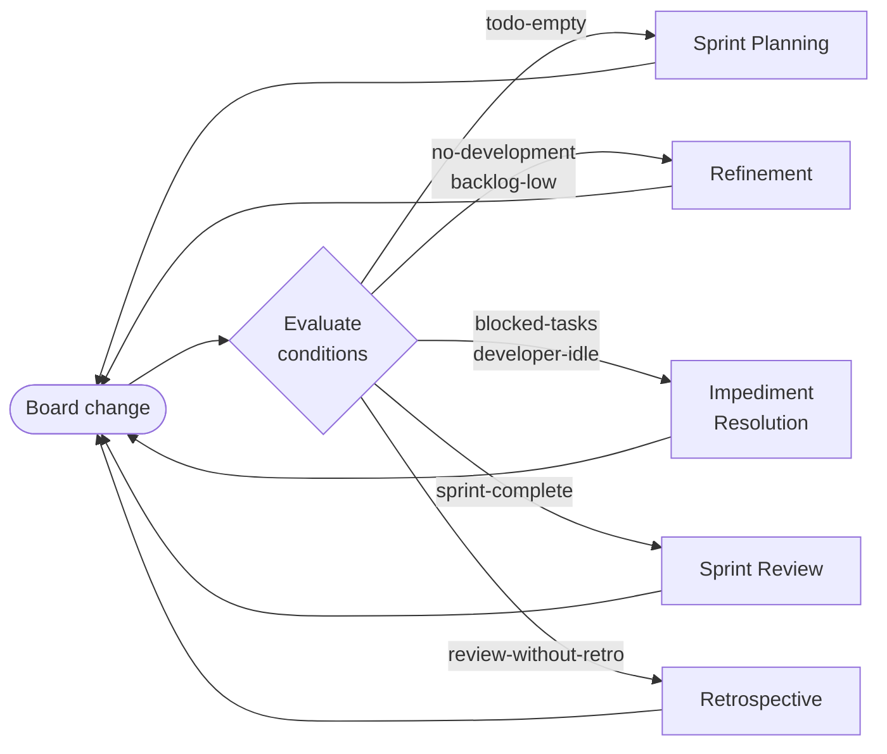
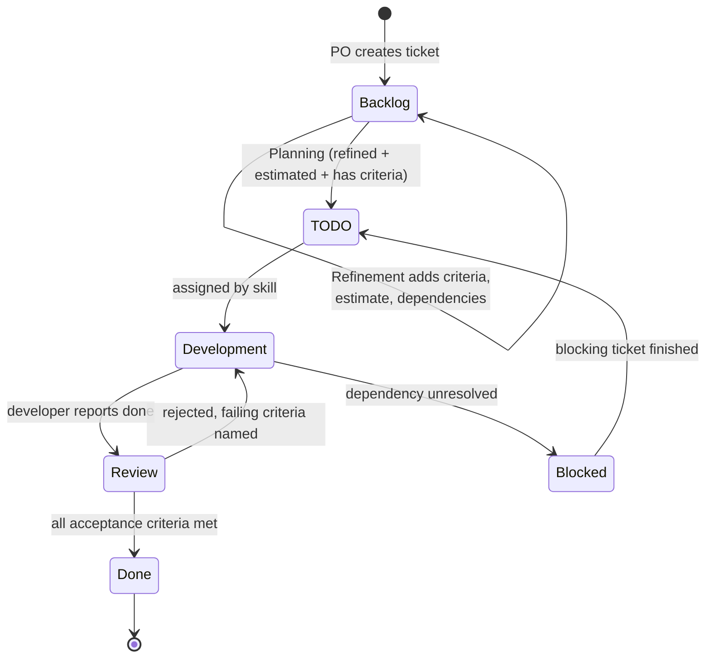
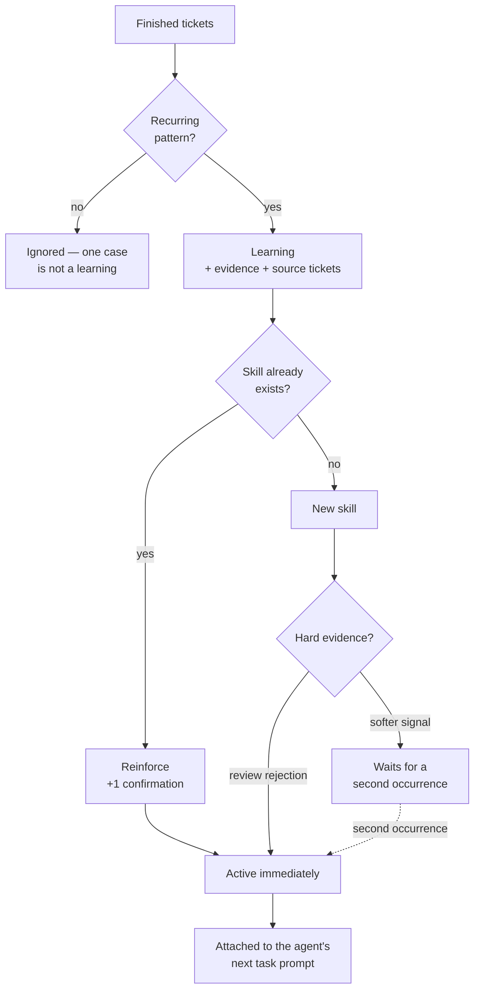
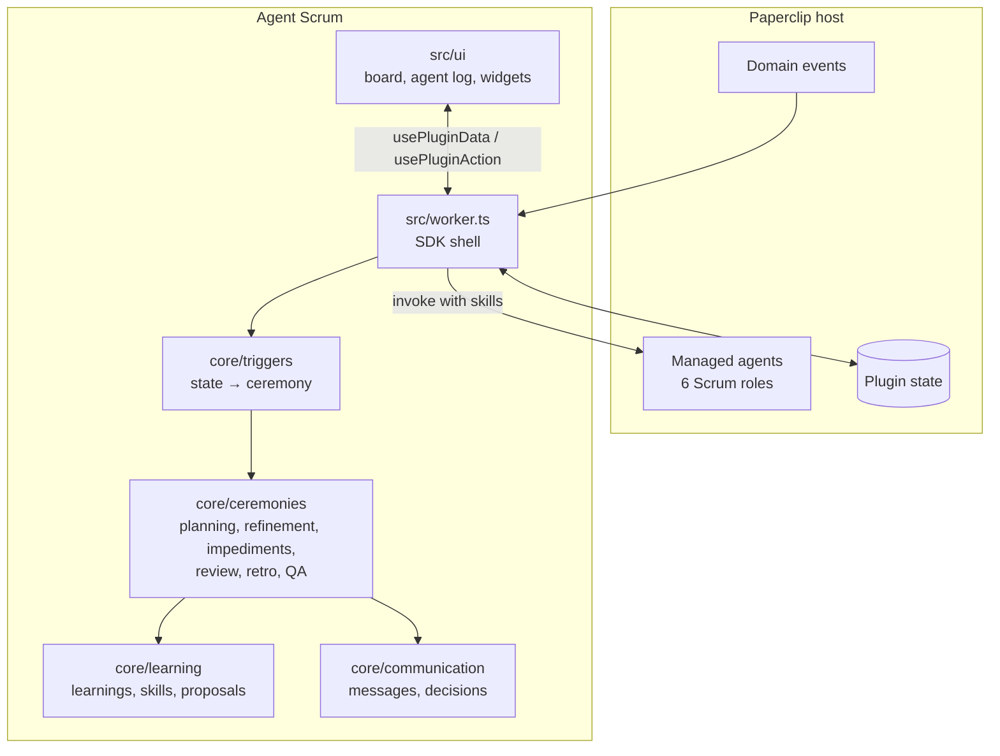

# Agent Scrum

A Paperclip plugin that runs a Scrum team of AI agents: ceremonies fire from
board state, tickets move through a Kanban board, and the retrospective turns
finished work into skills the team applies next sprint.


---

## What this is

Six agents — Product Owner, Scrum Master, Technical Lead, two Developers, QA —
move a backlog through Backlog → TODO → Development → Review → Done.

The plugin does not write code or user stories. It runs the *process*: it
decides what happens next, assigns work by skill, enforces the quality gate,
and asks the agents to do the parts that need judgement.

Two decisions shape everything else:

**No schedules.** Every ceremony is triggered by board state. AI agents finish
work faster than any cron expression can describe, so a standup "at 9am" would
be meaningless to them.

**Every event must produce something.** A ceremony that only reports is dead
weight. The daily standup was removed for exactly that reason — see
[Ceremonies](#ceremonies).

---

## Contents

1. [Install](#install)
2. [Ceremonies](#ceremonies) — what each one produces
3. [Triggers](#triggers) — what starts them
4. [Ticket lifecycle](#ticket-lifecycle)
5. [Learning loop](#learning-loop) — how the team improves
6. [Architecture](#architecture)
7. [Development](#development)
8. [Verified](#verified) and [Known limitations](#known-limitations)

---

## Install

### Prerequisites

- Node.js 22+ and pnpm
- A local Paperclip checkout you can run from source
- A running Paperclip instance (`pnpm paperclipai run`, default `http://127.0.0.1:3100`)

### 1. Fetch the plugin SDK

The plugin builds against `@paperclipai/plugin-sdk`, a workspace package inside
Paperclip that is not published to npm. Pack it from your checkout:

```bash
pnpm setup:sdk --paperclip /path/to/your/paperclip
```

This writes two tarballs into `.paperclip-sdk/` (gitignored).

### 2. Install and build

```bash
pnpm install
pnpm build
```

### 3. Install into your instance

```bash
paperclipai plugin install /absolute/path/to/paperclip-agent-scrum-plugin
```

Expected output:

```
✓ Installed schapat.agent-scrum v2.0.0 (ready)
```

### 4. Open the board

Open **Scrum Board** in the Paperclip navigation.

This step matters. The six agents do not exist until the board is opened.

The reason is a host rule worth knowing about: company-scoped calls are only
permitted inside an invocation the host started — an event, an action, or a
`getData` request. A call made from the worker's `setup()` carries no
invocation id and is rejected with *"company context is required"*. So the
plugin waits for the first request, takes the company from it, and reconciles
the team then. That also means it always binds to the company you are actually
looking at, instead of guessing.

### 5. Verify

```bash
paperclipai plugin inspect schapat.agent-scrum
paperclipai plugin logs schapat.agent-scrum
```

While developing, keep `pnpm dev` running — Paperclip watches `dist/` and
reloads the worker after each rebuild.

---

## Ceremonies

An event earns its place only if it leaves something behind. Measured by what
each one persists:

| Ceremony | Produces | Value |
|---|---|---|
| **Backlog Refinement** | Asks the Technical Lead for acceptance criteria, estimates, dependencies and risks; flags oversized tickets for splitting; asks the PO for new items | **High** — without ready tickets, planning has nothing to pull |
| **Sprint Planning** | Pulls tickets into the sprint within capacity, assigns by skill, starts the work | **High** — nothing moves without it |
| **QA Review** | Accepts to Done, or rejects to Development naming the criteria that failed | **High** — the only quality gate |
| **Impediment Resolution** | Clears blockers whose cause is gone, escalates real ones with a concrete task, fills idle capacity | **High** — keeps flow alive |
| **Sprint Review** | Records velocity, proposes follow-up work, asks the PO to decide on carry-over | **Medium–high** — connects delivery to planning |
| **Sprint Retrospective** | **Learnings → skills**, plus proposed backlog items | **High** — the only event that makes the team *better* |
| ~~Daily Scrum~~ | ~~Status reports~~ | **Removed** |

### Why the daily standup was removed

A standup exists so humans can find out what everyone else is doing. Agents
have no such problem — the board is fully visible to all of them at all times.
A report saying "I finished X and I'm working on Y" only repeats what the board
already shows.

Measurement confirmed it: the daily changed **no ticket at all**. It produced
messages and nothing else.

What *was* valuable was the Scrum Master's part — spotting blockers and idle
capacity. That is now **Impediment Resolution**, which acts instead of
reporting. When there is nothing to resolve, it deliberately leaves no record.

---

## Triggers

Ceremonies are evaluated after every board change, never on a timer.

| Trigger | Condition | Starts |
|---|---|---|
| `todo-empty` | TODO empty **and** refined tickets waiting | Sprint Planning |
| `no-development` | Nothing in Development and nothing sprint-ready | Refinement |
| `backlog-low` | Fewer than 5 sprint-ready tickets | Refinement |
| `blocked-tasks` | At least one ticket blocked | Impediment Resolution |
| `developer-idle` | A developer is free while TODO has work | Impediment Resolution |
| `sprint-complete` | Every sprint ticket is done | Sprint Review |
| `review-without-retro` | A review exists, the retrospective does not | Retrospective |



Two properties keep this stable:

- **Edge-triggered.** A condition fires when it *becomes* true, not while it
  stays true. Without this, a permanently empty TODO would restart planning
  forever. Once the condition goes false it is armed again.
- **Cascade limit.** A ceremony may trigger the next one (Review → Retro); the
  chain stops after five rounds.

Each trigger can be switched off individually in the plugin settings. Every
ceremony stays manually runnable from the board's ceremony bar.

---

## Ticket lifecycle



A ticket can only reach Done through Review — `in_progress → done` is not a
legal transition. Rejection is not a dead end: QA names the criteria that
failed, and that feedback lands in the ticket's comment history.

---

## Learning loop

The retrospective is how the team stops repeating itself. It inspects the
tickets finished in the sprint and looks for **evidence-backed patterns**:

| Source | Detected | Becomes |
|---|---|---|
| Review rejections | Same rejection reason on ≥ 2 tickets | Skill for developers, active immediately |
| Materialised risks | Risk was known, ticket blocked or rejected anyway | Skill for Tech Lead + developers |
| Flow bottlenecks | Column with ≥ 48h average dwell time | Skill for the responsible role |
| Technical notes | Notes on completed tickets | Reusable code knowledge |



Two rules keep this honest:

- **Every learning carries its evidence** and the tickets it came from. It is
  checkable, not invented.
- **A single case is not a learning.** One rejected ticket is normal; the same
  reason twice is a pattern. Softer signals start inactive and activate only
  when the pattern repeats — otherwise the skill list fills with noise.

Active skills are visible under **Agent log → Learnings** and are attached to
the prompt whenever the plugin wakes an agent for that role.

---

## Architecture



| Path | Responsibility |
|---|---|
| `src/manifest.ts` | Manifest: capabilities, UI slots, the six managed agents |
| `src/worker.ts` | SDK shell — loads state, exposes data/actions, evaluates triggers |
| `src/core/ceremonies/` | The six ceremonies plus skill-based assignment |
| `src/core/triggers/` | State conditions that start ceremonies, edge-triggered |
| `src/core/learning/` | Learning extraction, skills, story proposals |
| `src/core/communication/` | Agent messages and reasoned decisions |
| `src/core/types.ts` | Domain model (ticket, sprint, learning, skill) |
| `src/ui/` | Board page and two dashboard widgets |
| `agents/<key>/AGENTS.md` | Instructions for each managed agent |

Ceremonies are pure functions over a `WorkerState` value, which is why they are
testable without a running host.

### What the plugin does *not* do

It never invents content. User stories, acceptance criteria and estimates are
requested from the responsible agent via `ctx.agents.invoke`, carrying that
role's active skills as context. The plugin decides *what needs doing and by
whom*; the agents decide *what it says*.

---

## Development

```bash
pnpm setup:sdk --paperclip /path/to/paperclip   # once
pnpm install
pnpm dev                                        # watch build
pnpm test                                       # 278 tests
pnpm typecheck
```

Tests live next to the code they cover, under `src/core/**/__tests__/`.

---

## Verified

Against a live instance (`paperclipai plugin install`, then a `bridge:data`
call carrying company scope):

- Installs and reaches `ready`; registry, manifest and status health checks pass.
- All six managed agents are created and adopted — and only those six. A company
  usually has other agents (a CEO, other teams); they are deliberately not put
  on the Scrum board.
- Creating a ticket works, and an unrefined ticket **automatically triggers
  Backlog Refinement** — the state-driven trigger chain works end to end.

## Known limitations

Stated plainly, because the alternative is a README that lies:

- **Skills are delivered per invocation, not written into instructions.** The
  host has no API to rewrite a managed agent's instructions — managed agents
  are reconciled from the manifest. Active skills therefore travel with each
  wake-up prompt rather than living permanently in `AGENTS.md`.
- **The board is plugin-owned, not Paperclip issues.** Tickets live in plugin
  state. Making the board operate on Paperclip issues directly would be a
  rewrite, not a refactor.
- **Agent wake-up is not observed.** `ctx.agents.invoke` is called when a
  ceremony requests content, but whether the agents then produce user stories or
  acceptance criteria was not watched end to end.
- **Ceremony summaries and agent messages are in German.** The code, README and
  comments are English; the operational text the agents read is not yet.
- **No performance measurements.** Nothing here has been profiled under load.

---

## License

MIT
